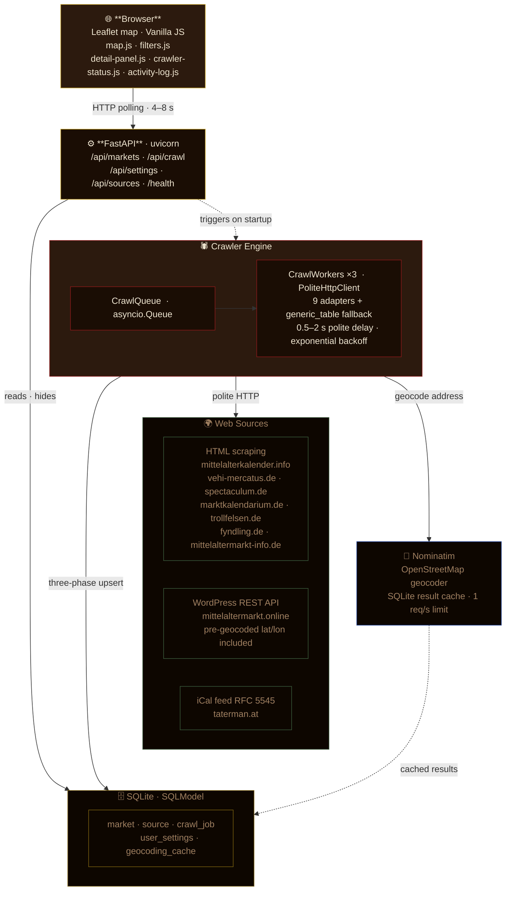

# ⚔ RitterRadar

<!-- pipelines, release and license -->
[](https://github.com/marcelpetrick/RitterRadar/actions/workflows/ci.yml)
[](https://github.com/marcelpetrick/RitterRadar/pkgs/container/ritterradar)
[](https://github.com/marcelpetrick/RitterRadar/actions/workflows/release.yml)
[](https://github.com/marcelpetrick/RitterRadar/releases/latest)
[](https://github.com/marcelpetrick/RitterRadar/releases/latest)
[](LICENSE)

<!-- stack, pinned to the versions this release ships -->
[](pyproject.toml)
[](pyproject.toml)
[](pyproject.toml)
[](src/ritterradar/database)
[](src/ritterradar/static/vendor)
[](https://github.com/marcelpetrick/RitterRadar/pkgs/container/ritterradar)

<!-- quality gate and project health -->
[](https://docs.astral.sh/ruff/)
[](pyproject.toml)
[](pyproject.toml)
[](config/sources.yaml)
[](https://github.com/marcelpetrick/RitterRadar/commits/master)

**Discover medieval, Renaissance, Viking, fantasy and themed Christmas events on your own map.**

[Get started](#installation) · [Run with Docker](#docker) · [Download a release](https://github.com/marcelpetrick/RitterRadar/releases/latest) · [Changelog](CHANGELOG.md)

> *Hearken, good traveller, and lend thine ear!*
>
> *RitterRadar is a cunning instrument, forged in the fires of Python, to aid thee in thy noble quest: the discovery of medieval markets, Renaissance fairs, Viking spectacles, and Christmas revelries of the ancient style - across the German lands and beyond.*
>
> *This tool doth dispatch tireless web-crawling agents into the vast digital wilderness. They return laden with tidings of forthcoming events - their names, their dates, their whereabouts — and store all within a local treasury of SQLite.*
>
> *Upon thine own machine it doth render a most beautiful interactive map, whereupon thou mayest **filter by period** (which months thou wishest to survey) and **filter by space** (thy home position and a radius of thy choosing, from a stone's throw to 1024 leagues). Click upon any marker to learn the full particulars. The crawler runneth in the background; the map refresheth on its own accord.*
>
> *No account is required. Thy settings and event treasury remain local; external services provide event pages, geocoding and map tiles. Thus: a helper tool that crawleth the web with custom crawlers, presenteth the findings, and alloweth thee to sift them by time and by distance.*

---

**Author: Marcel Petrick <mail@marcelpetrick.it>**

**License: GPLv3 or later. See `LICENSE`.**

**Note: project is generated with AI.**

> *"Free as in freedom — and as in the freedom to roam medieval markets."*

### The map in action


---

## Project status

Current version: `0.0.91` — fully functional and actively maintained.

| Area | State |
|---|---|
| **Crawling** | 9 live adapters (HTML, WordPress REST, iCal), polite client with backoff and per-adapter failure isolation |
| **Data** | SQLite via SQLModel, Alembic migrations, three-phase deduplication, cached Nominatim geocoding |
| **Interface** | Leaflet map, month/radius/type filters, upcoming-events preview, detail panel, live crawler log |
| **Quality** | ruff, mypy strict, offline pytest suite with a 90 % coverage gate, offline Playwright regression run |
| **Delivery** | Multi-arch container on GHCR with SBOM and provenance, GitHub release with wheel and sdist |
| **Development** | Continues through fixes, source maintenance and scoped extensions — no core feature is missing |

### Versioning

The version is `MAJOR.MINOR.PATCH` and `version` in
[`pyproject.toml`](pyproject.toml) is its single source of truth;
`src/ritterradar/__init__.py` reads it back through `importlib.metadata`, and the
web UI shows it in the header. Every commit raises the `PATCH` number unless a
change deliberately calls for a `MINOR` or `MAJOR` bump. A public release exists
only where a `vX.Y.Z` tag matches that version and
[`CHANGELOG.md`](CHANGELOG.md) documents it — see
[Publishing pipeline](#publishing-pipeline).

---

## Features

| Feature | Description |
|---|---|
| **Auto-crawling** | Background workers harvest events from all configured sources on startup |
| **9 active adapters** | mittelalterkalender.info, vehi-mercatus.de, spectaculum.de, marktkalendarium.de, mittelaltermarkt.online, taterman.at, trollfelsen.de, fyndling.de, mittelaltermarkt-info.de |
| **Multi-format parsing** | HTML scraping (BeautifulSoup), REST API (WordPress Events Calendar), iCal feeds (RFC 5545) |
| **Deduplication** | Three-phase upsert (PLZ → city → source_url) merges the same event from multiple sources |
| **Pre-geocoded fast path** | mittelaltermarkt.online supplies lat/lon directly — Nominatim skipped for ~530 events per crawl |
| **Adapter versioning** | Each adapter carries `__version__` + `_VERIFIED_DATE` for traceability |
| **Geocoding** | Nominatim (OpenStreetMap) with SQLite cache and rate-limit compliance |
| **Distance filter** | Haversine straight-line distance, 0–1024 km radius from home pin |
| **Time filter** | Month-range selector, current month through next 12 months |
| **Type filter** | Medieval · Renaissance · Viking · Fantasy · Christmas |
| **Upcoming-events list** | Chronological preview of the current filters with a one-click copyable plain-text list |
| **Detail panel** | Click a marker for name, dates, location, program, source link, hide button |
| **Crawler status** | Live badge counts + per-job log in the status bar |
| **Activity log** | Collapsible live log panel in the map corner |
| **Medieval UI** | Dark wood + aged gold + burgundy theme with IM Fell English font; version shown in header |
| **Tooltips** | Hover over any legend or type-filter item for source attribution and meaning |

---

## Requirements

- **Python 3.12+** (tested on 3.12, 3.13 and 3.14) and **pip** — *or* just **Docker** (see [Docker](#docker))
- **Internet access** for map tiles and initial crawling

---

## Installation

**Recommended — one command does everything** (venv, deps, DB migration):

```bash
# 1. Clone the repository
git clone https://github.com/marcelpetrick/RitterRadar.git
cd RitterRadar

# 2. Copy and edit the environment file
cp .env.example .env
# Set RITTERRADAR_GEOCODER_EMAIL to your e-mail address

# 3. Run the setup script (creates .venv/, installs deps, migrates DB)
bash scripts/prepare.sh
```

> `prepare.sh` works on Arch/Manjaro and any system that enforces
> PEP 668 (externally-managed-environment).  It never touches the
> system Python — everything goes into `.venv/`.

**Manual alternative:**

```bash
python3 -m venv .venv
source .venv/bin/activate
pip install -e ".[dev]"
alembic upgrade head
```

---

## Docker

A multi-arch image (`linux/amd64`, `linux/arm64`) is published to the GitHub
Container Registry as
[`ghcr.io/marcelpetrick/ritterradar`](https://github.com/marcelpetrick/RitterRadar/pkgs/container/ritterradar).

| Tag | Content |
|---|---|
| `latest` | Most recent release |
| `X.Y.Z` | A specific release (e.g. `0.0.91`) |
| `X.Y` | Latest release in that minor series (e.g. `0.0`) |
| `edge` | Latest build of `master` |
| `sha-<commit>` | Build of one exact commit |

### Run the published image

```bash
docker run -d --name ritterradar \
  -p 127.0.0.1:8000:8000 \
  -v ritterradar-data:/app/data \
  -e RITTERRADAR_GEOCODER_EMAIL=your@email.example \
  ghcr.io/marcelpetrick/ritterradar:latest
```

Then open **http://127.0.0.1:8000**. Stop with `docker stop ritterradar`;
the database survives in the `ritterradar-data` volume.

### Docker Compose

```bash
docker compose up -d                                 # published image
docker compose up -d --build                         # build from this checkout
RITTERRADAR_PUBLISH_PORT=13370 docker compose up -d  # different host port
```

`compose.yaml` passes only `RITTERRADAR_GEOCODER_EMAIL`, `RITTERRADAR_WORKERS`,
`RITTERRADAR_LOG_LEVEL` and `RITTERRADAR_CRAWL_INTERVAL_HOURS` into the
container (values are taken from your shell or `.env`), so a native
`RITTERRADAR_HOST=127.0.0.1` does not leak in and break binding.

### Build the image yourself

```bash
docker build -t ritterradar:local .     # or: just docker-build
docker run --rm -p 127.0.0.1:8000:8000 \
  -v ritterradar-data:/app/data ritterradar:local   # or: just docker-run
```

### Image details

- Based on `python:3.14-slim` (Debian trixie), runs as the non-root user
  `ritter` (UID/GID 10001) and binds to `0.0.0.0:8000` inside the container.
- Data lives in the volume `/app/data` (`RITTERRADAR_DB_PATH=/app/data/ritterradar.db`).
  For a bind mount instead of a named volume, make the host directory writable
  for UID 10001: `mkdir -p data && sudo chown 10001:10001 data`.
- All `RITTERRADAR_*` variables from [Configuration](#configuration) work as
  `-e` options. To use your own source list, mount it read-only:
  `-v "$PWD/config/sources.yaml:/app/config/sources.yaml:ro"`.
- A `HEALTHCHECK` polls `/health`; `docker ps` shows the container as `healthy`.
- Images carry SBOM and build provenance; verify with
  `gh attestation verify oci://ghcr.io/marcelpetrick/ritterradar:latest --owner marcelpetrick`.

### Publishing pipeline

The workflows share the same Python 3.12–3.14 quality checks and browser tests.
For releases, a tag must match the version in `pyproject.toml` and have a
changelog entry before those checks run. Docker builds and smoke-tests `/health`,
`/`, static files and the crawl API before publishing both architectures:

| Trigger | Result |
|---|---|
| Pull request | Build + smoke test only, nothing pushed |
| Push to `master` | `:edge`, `:sha-<commit>` |
| Tag `vX.Y.Z` | Quality checks → Docker publication → wheel/sdist build → public GitHub release |

To cut a release, bump `version` in `pyproject.toml`, add its changelog entry,
commit and push `master`, then push the matching tag:

```bash
git tag -a v0.0.91 -m "RitterRadar 0.0.91"
git push origin v0.0.91
```

`release.yml` publishes the GitHub release only after the checks, container
publication and package metadata validation succeed. The wheel and sdist are
attached before the release becomes public. Container tags are `:X.Y.Z`, `:X.Y`,
`:latest` and `:sha-<commit>`; `:edge` continues to follow `master`.

---

## Configuration

Copy `.env.example` to `.env` and adjust as needed:

```bash
cp .env.example .env
```

Key settings:

| Variable | Default | Description |
|---|---|---|
| `RITTERRADAR_DB_PATH` | `data/ritterradar.db` | SQLite database file path |
| `RITTERRADAR_SOURCES_FILE` | `config/sources.yaml` | Crawl source list |
| `RITTERRADAR_WORKERS` | `3` | Parallel crawler workers |
| `RITTERRADAR_GEOCODER_EMAIL` | *(empty)* | Your email for Nominatim user-agent (required by ToS) |
| `RITTERRADAR_HOST` | `127.0.0.1` | Bind address |
| `RITTERRADAR_PORT` | `8000` | HTTP port |
| `RITTERRADAR_LOG_LEVEL` | `INFO` | Log level |

> **Set your Nominatim email** — the OpenStreetMap geocoder requires a valid
> contact in the User-Agent.  Without it geocoding may be rate-limited.

---

## Running the App

### Development (auto-reload)

```bash
bash scripts/start_dev.sh
# or: uvicorn ritterradar.main:app --reload
```

### Production

```bash
bash scripts/start.sh
# or: ritterradar          (console script after pip install)
```

Open your browser at **http://127.0.0.1:8000** when using the default port.
If `.env` contains `RITTERRADAR_PORT=13370`, as in the local development setup,
open **http://127.0.0.1:13370** instead. Both startup scripts print the exact URL.

The app:
1. Creates `data/ritterradar.db` automatically on first start
2. Seeds all sources from `config/sources.yaml`
3. Starts background crawler workers
4. Opens a beautiful medieval-themed map

---

## Using the Map

| Action | Effect |
|---|---|
| Enter postal code / city in **Heimatort** | Geocodes and sets your home pin; enables distance filter |
| Click **Suchen** | Confirm the home location entry |
| Drag **Umkreis** slider (0–1024 km) | Limits markers to N km radius from home |
| Choose months in **Zeitraum** | Filters by event start date |
| Check/uncheck **Markttyp** boxes | Show/hide event categories |
| Hover a type checkbox or legend item | Shows tooltip with category meaning and data sources |
| Click **Karte aktualisieren** | Re-applies all filters |
| Expand **Nächste Märkte** | Shows every event matching the current map filters in chronological order |
| Click **Kopieren** in the event list | Copies the complete filtered list with dates, locations, and distances as plain text |
| **Hover** a marker | Shows name and date range |
| **Click** a marker | Opens detail panel on the right |
| **↗ Zur Originalseite** | Opens the source page in a new tab |
| **🚫 Ausblenden** | Hides the market from the map (data kept in DB) |
| Click **⟳ Neu laden** in status bar | Triggers a fresh crawl of all sources |

---

## Crawler Management

### Trigger a crawl via script

```bash
bash scripts/trigger_crawl.sh
```

### Check crawl status

```bash
bash scripts/crawl_status.sh
```

### Via API

```bash
# Trigger
curl -X POST http://127.0.0.1:8000/api/crawl/trigger

# Status
curl http://127.0.0.1:8000/api/crawl/status | python3 -m json.tool
```

---

## Adding New Crawl Sources

### Option A — Use the generic table adapter

Add a new entry to `config/sources.yaml`:

```yaml
- name: "My New Site"
  url: "https://www.example.de/termine"
  adapter: "generic_table"
  enabled: true
```

Restart the app.  The generic adapter tries to extract events from HTML tables
automatically.  It works on many sites without any code change.

### Option B — Write a dedicated adapter

1. Create `src/ritterradar/crawler/adapters/mysite.py`:

```python
# SPDX-License-Identifier: GPL-3.0-or-later
from ritterradar.crawler.base_adapter import AbstractCrawlerAdapter, MarketData
from ritterradar.crawler.http_client import PoliteHttpClient
from ritterradar.crawler.registry import register
from bs4 import BeautifulSoup
from datetime import date

__version__ = "0.1.0"          # bump when parsing logic changes
_VERIFIED_DATE = "YYYY-MM-DD"  # last date you confirmed the page structure

@register("mysite")
class MySiteAdapter(AbstractCrawlerAdapter):
    SOURCE_NAME = "My Site"
    BASE_URL    = "https://www.mysite.de/events"

    async def crawl(self, client: PoliteHttpClient) -> list[MarketData]:
        response = await client.get(self.BASE_URL)
        response.raise_for_status()
        soup = BeautifulSoup(response.text, "lxml")
        results = []
        for article in soup.find_all("article", class_="event"):
            name = article.find("h2").get_text(strip=True)
            results.append(MarketData(
                name=name,
                start_date=date(2026, 7, 1),   # replace with real parsing
                end_date=date(2026, 7, 3),
                city="Berlin",
                postal_code="10115",
                source_url=self.BASE_URL,
            ))
        return results
```

2. Import it in `src/ritterradar/crawler/adapters/__init__.py`:

```python
from ritterradar.crawler.adapters import mysite  # noqa: F401
```

3. Add to `config/sources.yaml`:

```yaml
- name: "My Site"
  url: "https://www.mysite.de/events"
  adapter: "mysite"
  enabled: true
```

4. Restart the app.

See `docs/adapter-guide.md` for a complete walk-through.

---

## Database Management

### Reset the database

```bash
bash scripts/reset_db.sh
```

This deletes the SQLite file and recreates the schema.  All markets and crawl
history are lost.

### Apply migrations (after upgrading)

```bash
alembic upgrade head
```

### Inspect the database

```bash
sqlite3 data/ritterradar.db ".tables"
sqlite3 data/ritterradar.db "SELECT name, start_date, city FROM market LIMIT 20;"
```

---

## Development

### Install dev dependencies

```bash
bash scripts/prepare.sh          # first time
# or manually:
pip install -e ".[dev]"
```

### Run tests

```bash
pytest                       # with coverage report; fails below 90 % coverage
pytest --no-cov -x -q       # fast, stop on first failure
```

The suite runs fully offline: crawler adapters are tested against HTML, JSON
and iCal fixtures through a fake HTTP client, and the geocoder is stubbed.

### Browser regression tests

```bash
pip install -e ".[dev,browser]"
python -m playwright install chromium
python scripts/browser_test.py
```

The browser test starts the real app with a temporary database, fixed September
2026 dates, and disabled crawlers. External requests are blocked. It checks month
overlap, theme exclusions, map/list consistency, duplicate handling, and empty or
invalid filters. CI runs it on Python 3.14. An installed Chromium can be selected
with `RITTERRADAR_BROWSER_EXECUTABLE`.

### Audit live calendar results

```bash
python scripts/audit_month.py --month 2026-09
```

This read-only JSON audit lists per-source crawl results, excluded records,
unmapped or uncertain locations, conflicting dates, and title/year mismatches.
Counts are source records, not unique events. The app shows events overlapping
the selected months, including events that start in the preceding month.

The supported themes are medieval, Renaissance, Viking, fantasy, and themed
Christmas events. Explicit cancellations, Roman/Stone Age events, science-fiction
events, and unrelated museum/workshop programmes are excluded. Because Fyndling
also includes general museum programmes, its titles must identify a supported
theme or historical fair; ambiguous titles can be omitted. Exclusions apply to
stored records too, without deleting them or changing the user's hidden flags.

### Lint and format

```bash
ruff check src tests scripts/browser_test.py scripts/audit_month.py  # lint
ruff format src tests        # format
mypy src                     # type check
```

### Quality gate (all in one)

```bash
bash scripts/local_pipeline.sh          # or: just ci
bash scripts/local_pipeline.sh --no-browser --no-docs   # lint, types and tests only
```

`local_pipeline.sh` activates `.venv/` when present, runs every stage even after a
failure, and closes with a summary table:

```text
========== Local Pipeline Summary ==========
Lint                : PASS
Format              : PASS
Types               : PASS
Tests               : PASS
Browser tests       : PASS
Documentation       : PASS
===========================================
```

The gate requires zero ruff findings, unchanged ruff formatting, a clean strict
`mypy` run over `src`, the offline pytest suite at ≥ 90 % coverage, and the
offline browser regression run; the Sphinx build follows. Stages whose optional
tools are missing are reported as `SKIP` instead of silently passing. CI runs the
same checks on Python 3.12, 3.13 and 3.14, with the browser stage on 3.14.

Single steps, without `just`:

```bash
ruff check src tests scripts/browser_test.py scripts/audit_month.py
ruff format --check src tests scripts/browser_test.py scripts/audit_month.py
mypy src && pytest && python scripts/browser_test.py
```

### Build Sphinx documentation

```bash
sphinx-build docs/source docs/_build/html
open docs/_build/html/index.html
```

---

## Documentation

| Document | Content |
|---|---|
| [`CHANGELOG.md`](CHANGELOG.md) | Released versions and what each one changed |
| [`docs/architecture.md`](docs/architecture.md) | C4 container and component diagrams |
| [`docs/september-2026-audit.md`](docs/september-2026-audit.md) | Read-only audit of one month of live crawl results |
| [`documents/00_VISION.md`](documents/00_VISION.md) | Project vision and non-negotiable constraints |
| [`documents/01_plan.md`](documents/01_plan.md) | Phase plan from skeleton to quality loop |
| [`documents/02_issues.md`](documents/02_issues.md) | Known issues and their resolution state |
| [`documents/03_sources.md`](documents/03_sources.md) | Per-source structure, disabled sources, rejected candidates |
| [`documents/04_ideas.md`](documents/04_ideas.md) | Ideas not scheduled yet |
| `docs/source/` | Sphinx API documentation (`sphinx-build docs/source docs/_build/html`) |

---

## API Reference

Interactive docs available at **http://127.0.0.1:8000/api/docs** (Swagger UI)
and **http://127.0.0.1:8000/api/redoc** (ReDoc) when the app is running.

Key endpoints:

| Method | Path | Description |
|---|---|---|
| `GET` | `/api/markets` | List markets with optional filters |
| `POST` | `/api/markets/{id}/hide` | Toggle market visibility |
| `GET` | `/api/sources` | List configured crawl sources |
| `GET` | `/api/crawl/status` | Crawler queue state + recent jobs |
| `POST` | `/api/crawl/trigger` | Enqueue all enabled sources now |
| `GET` | `/api/settings` | Get user settings (home location, etc.) |
| `PUT` | `/api/settings` | Update user settings |
| `GET` | `/api/settings/geocode?q=…` | Geocode an address |
| `GET` | `/health` | Liveness check |

---

## Architecture

See `docs/architecture.md` for full C4 container and component diagrams.


