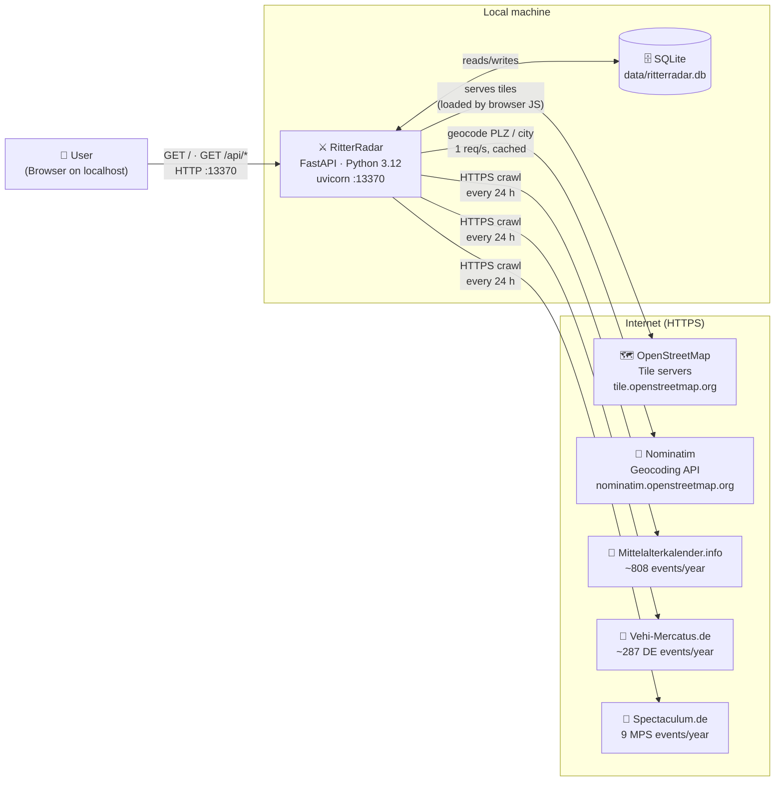
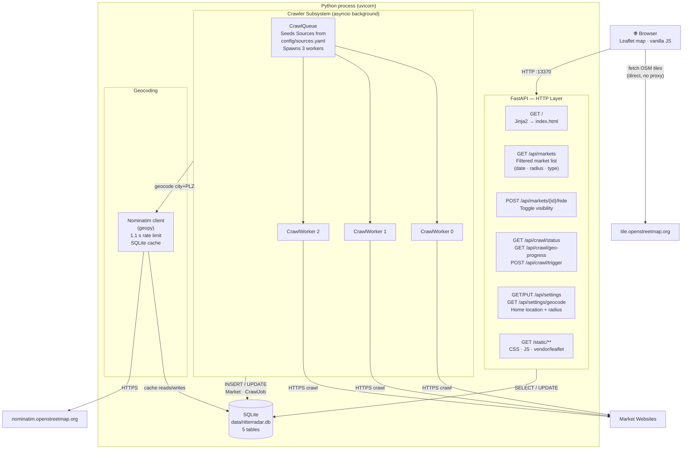
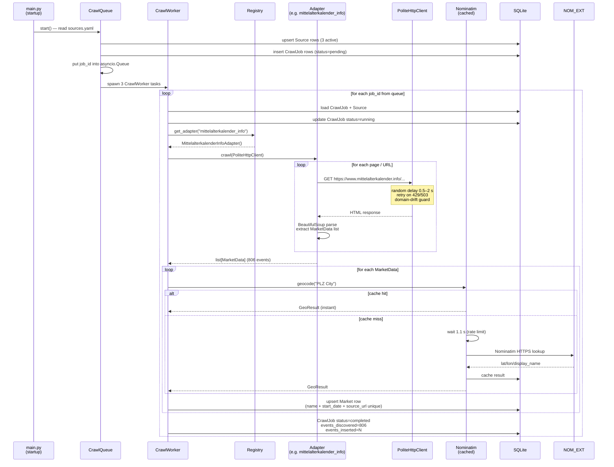
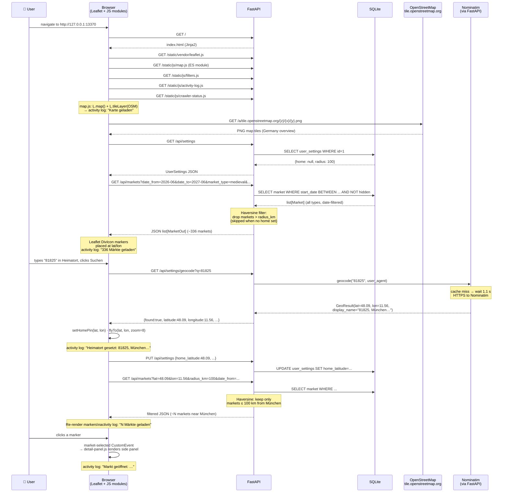
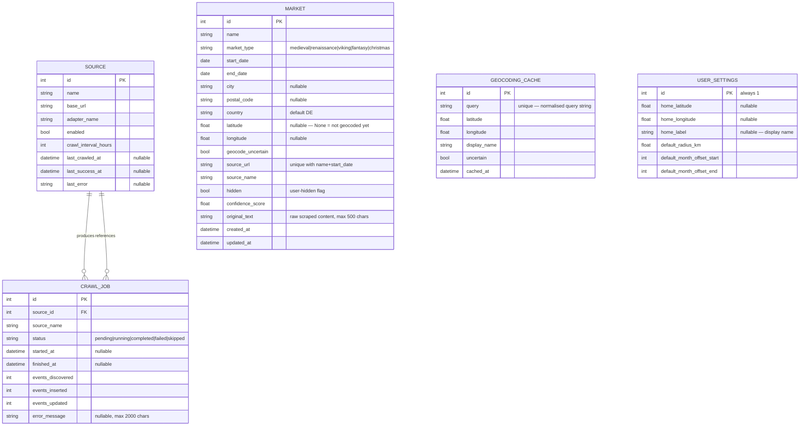
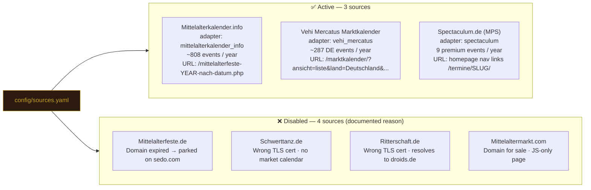
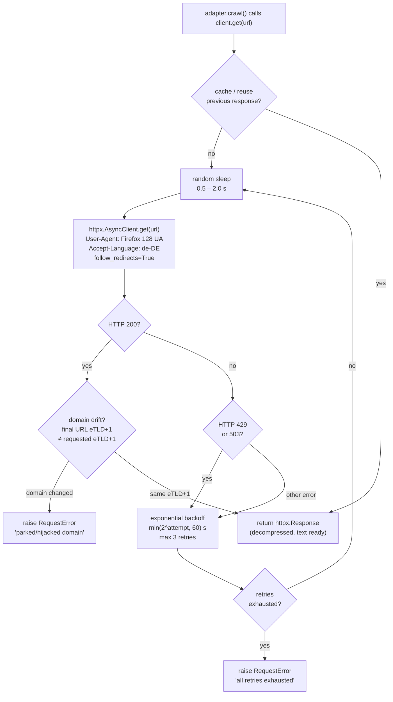
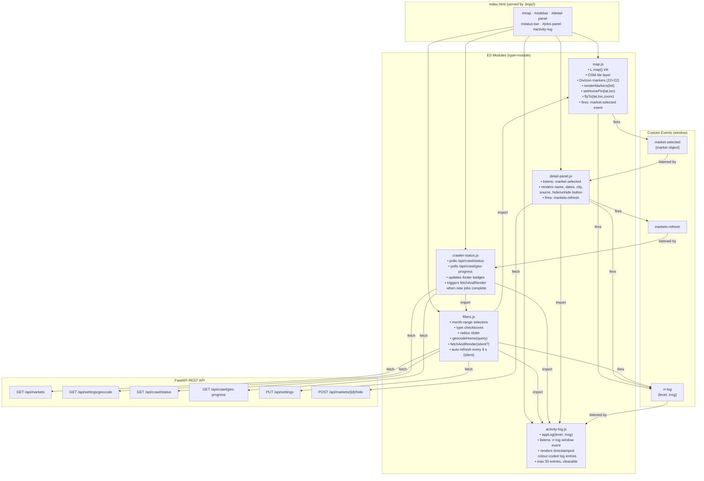

# RitterRadar — Architecture Documentation

> Last updated: 2026-06-25 · Version 0.0.26

RitterRadar is a **local-first** Python web application.
It crawls German medieval market websites in the background, geocodes every event,
and lets the user explore them on an interactive OpenStreetMap map.
Everything runs in a single Python process, stores data in a local SQLite file,
and requires no external infrastructure (no cloud, no broker, no database server).

---

## C4 Level 1 — System Context

Who uses it and what external systems does it touch?



---

## C4 Level 2 — Container Diagram

What are the major building blocks inside the single process?



---

## C4 Level 3 — Crawler Pipeline

How does a single crawl job flow from queue to database?



---

## C4 Level 3 — Web UI Data Flow

How does the browser load and display the map when a user searches?



---

## Data Model (ER Diagram)

Five tables in `data/ritterradar.db`:



UniqueConstraint on `market(name, start_date, source_url)` — prevents duplicate inserts across re-crawls.

---

## Active Crawler Sources (as of 2026-06-25)



---

## HTTP Client Safety Features

Every outbound crawler request goes through `PoliteHttpClient`:



---

## Frontend Module Architecture

The browser-side code is split into ES modules that communicate via **Custom Events** (no shared global state):



---

## Key Design Decisions

| Decision | Choice | Why |
|---|---|---|
| Single process | asyncio Tasks (not Celery/RQ) | No broker, no Redis, runs anywhere; crawlers and FastAPI share one event loop |
| Database | SQLite | Zero infrastructure; fits in one file; sufficient for < 100k events |
| Geocoding rate limit | 1.1 s/request + SQLite cache | Nominatim ToS; cache means PLZ "81825" is only looked up once ever |
| Tiles | OpenStreetMap standard (`tile.openstreetmap.org`) | Free, widely accessible, no API key |
| Leaflet | Bundled locally (`static/vendor/leaflet.js`) | No CDN dependency; works on offline/firewalled machines |
| Adapter pattern | `@register` decorator + registry dict | New source = one file + one YAML line; no core code change |
| Domain-drift guard | eTLD+1 comparison in PoliteHttpClient | Detects parked/expired domains automatically (caught mittelalterfeste.de → sedo.com) |
| No brotli | Accept-Encoding omitted from headers | httpx cannot decode brotli without the `brotli` package; omitting forces gzip/deflate which httpx handles natively |
| Frontend logging | Activity log panel + `rr-log` CustomEvent bus | Every UI action shows visible feedback without alert() dialogs |
| Module deduplication | ES module `import` + `window` event bus | `activity-log.js` is imported by three modules but only evaluated once |

---

## Directory Layout (as built)

```
RitterRadar/
├── src/ritterradar/
│   ├── main.py                      # FastAPI app + asyncio lifespan
│   ├── config.py                    # pydantic-settings (RITTERRADAR_* prefix)
│   ├── models/
│   │   ├── market.py                # Market SQLModel
│   │   ├── source.py                # Source SQLModel
│   │   ├── crawl_job.py             # CrawlJob SQLModel
│   │   ├── user_settings.py         # UserSettings (single row, id=1)
│   │   └── geocoding_cache.py       # GeocodingCache SQLModel
│   ├── database/
│   │   ├── engine.py                # get_engine(), create_tables()
│   │   └── session.py               # get_session() FastAPI dependency
│   ├── crawler/
│   │   ├── base_adapter.py          # AbstractCrawlerAdapter ABC + MarketData
│   │   ├── http_client.py           # PoliteHttpClient (delay, backoff, drift-guard)
│   │   ├── queue.py                 # CrawlQueue (seeds DB, spawns workers)
│   │   ├── worker.py                # CrawlWorker (geocode + upsert, failure isolation)
│   │   ├── registry.py              # @register decorator + get_adapter()
│   │   └── adapters/
│   │       ├── mittelalterkalender_info.py  # ✅ 808 events/year
│   │       ├── vehi_mercatus.py             # ✅ 287 DE events/year
│   │       ├── spectaculum.py               # ✅ 9 MPS events/year
│   │       ├── mittelalterfeste.py          # ❌ domain expired
│   │       ├── ritterschaft.py              # ❌ wrong TLS cert
│   │       └── schwerttanz.py               # ❌ wrong TLS cert
│   ├── geocoding/
│   │   ├── nominatim.py             # async Nominatim + SQLite cache + rate limit
│   │   └── haversine.py             # distance_km(lat1,lon1,lat2,lon2)
│   ├── api/
│   │   ├── markets.py               # GET /api/markets, POST /{id}/hide
│   │   ├── crawl.py                 # GET /status, GET /geo-progress, POST /trigger
│   │   ├── settings.py              # GET/PUT /api/settings + geocode proxy
│   │   └── sources.py               # GET /api/sources
│   ├── templates/
│   │   ├── base.html                # Leaflet CSS from /static/vendor/
│   │   └── index.html               # full SPA layout
│   └── static/
│       ├── css/ritterradar.css      # medieval palette + all component styles
│       ├── js/
│       │   ├── map.js               # Leaflet init, markers, OSM tiles
│       │   ├── filters.js           # sidebar controls + fetchAndRender()
│       │   ├── detail-panel.js      # market detail side panel
│       │   ├── crawler-status.js    # footer badges + jobs panel polling
│       │   └── activity-log.js      # UI activity log panel
│       └── vendor/
│           ├── leaflet.js           # Leaflet 1.9.4 (local, no CDN)
│           ├── leaflet.css
│           └── images/              # default Leaflet marker PNGs
├── config/
│   └── sources.yaml                 # source list (edit without code change)
├── data/
│   └── ritterradar.db               # SQLite — created by prepare.sh
├── scripts/
│   ├── prepare.sh                   # one-time setup (venv + pip + alembic)
│   ├── start_dev.sh                 # uvicorn with --reload
│   ├── start.sh                     # production start
│   ├── crawl_e2e_test.sh            # end-to-end adapter test (no server needed)
│   └── reset_db.sh                  # drop + recreate database
├── tests/                           # 48 pytest tests
├── documents/
│   ├── 00_VISION.md
│   ├── 01_plan.md
│   ├── 02_issues.md                 # first-run failure log (historical)
│   └── 03_sources.md                # per-source HTML structure + quirks
├── docs/
│   └── architecture.md              # this file
├── alembic/                         # DB migration history
├── pyproject.toml                   # version 0.0.26 · single source of truth
├── .env.example                     # copy to .env before first run
└── README.md
```
