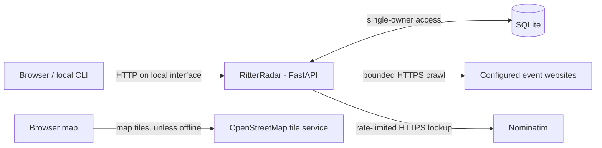
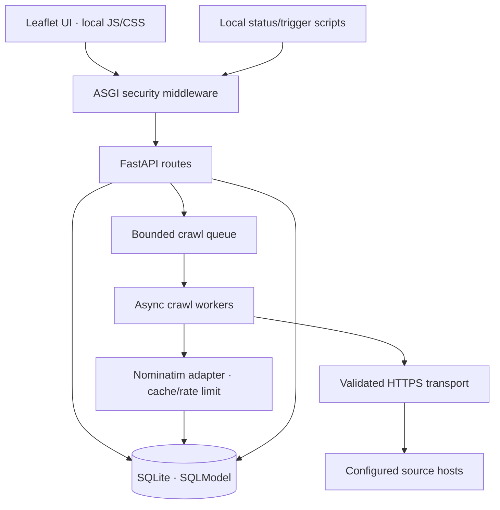
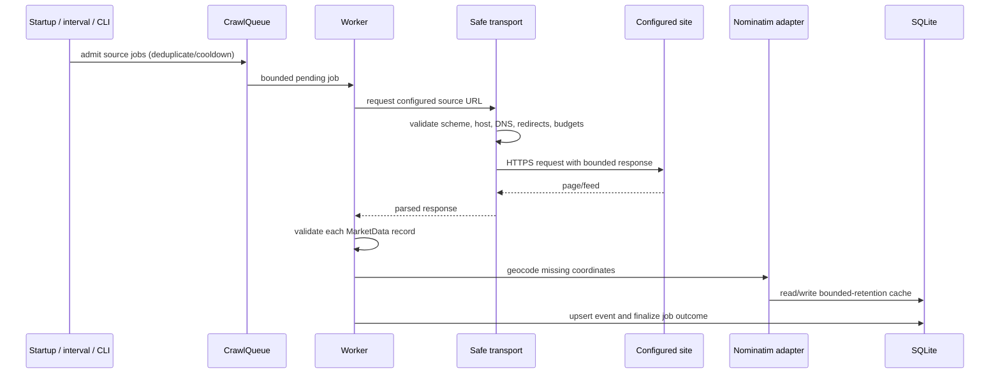
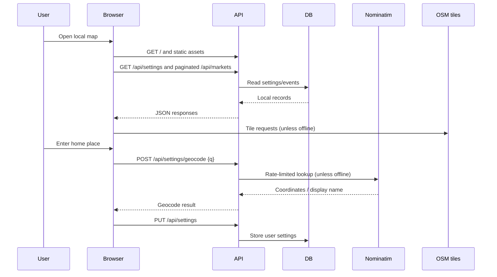

# RitterRadar — Architecture

> Updated: 2026-09-28 · documentation target: v0.2.0

RitterRadar is a local-first Python 3.12–3.14 application. FastAPI serves a
Leaflet map and JSON API, asyncio workers crawl configured event sources, and
SQLModel stores events and user settings in SQLite. One application process
owns a database at a time. There is no hosted account service or external
database.

## System context

```mermaid
graph LR
    User["Browser / local CLI"] -->|"HTTP on local interface"| App["RitterRadar · FastAPI"]
    App <-->|"single-owner access"| DB[("SQLite")]
    App -->|"bounded HTTPS crawl"| Sources["Configured event websites"]
    App -->|"rate-limited HTTPS lookup"| Geo["Nominatim"]
    Browser["Browser map"] -->|"map tiles, unless offline"| OSM["OpenStreetMap tile service"]
```

The native server binds to `127.0.0.1` by default. It validates the request
Host against `RITTERRADAR_ALLOWED_HOSTS`. Non-loopback clients need a configured
`RITTERRADAR_AUTH_TOKEN` of at least 32 characters and authenticate with HTTP
Basic (`ritterradar` as username, token as password) or a Bearer token. The
token is not placed in HTML or browser JavaScript. Unsafe browser requests also
need the app's same-origin request marker and are rejected for a foreign Origin
or cross-site Fetch Metadata. Use HTTPS when a trusted reverse proxy exposes the
service beyond the local machine; configure its public Host explicitly.

The browser loads OSM tiles directly; tile traffic does not pass through
RitterRadar. Its referrer policy sends only the application origin to the tile
server, never page paths or query values. Geocoding sends the entered place to
Nominatim. Crawling fetches
pages from the hosts configured for each source. `RITTERRADAR_OFFLINE=true`
disables crawling and geocoding and removes the tile host from the page's CSP.

## Runtime components

```mermaid
flowchart TB
    Browser["Leaflet UI · local JS/CSS"] --> Boundary["ASGI security middleware"]
    CLI["Local status/trigger scripts"] --> Boundary
    Boundary --> API["FastAPI routes"]
    API --> DB[("SQLite · SQLModel")]
    API --> Queue["Bounded crawl queue"]
    Queue --> Worker["Async crawl workers"]
    Worker --> HTTP["Validated HTTPS transport"]
    HTTP --> Websites["Configured source hosts"]
    Worker --> Geocoder["Nominatim adapter · cache/rate limit"]
    Geocoder --> DB
    API --> DB
```

The middleware checks Host, authentication policy, mutation origin, body and
query length, request rate, and concurrent request bounds. Responses carry a
Content Security Policy, framing denial, MIME sniffing protection, referrer and
permissions policies, and `Cache-Control: no-store`. `/health` is liveness;
`/ready` checks application and worker readiness. Interactive Swagger/ReDoc
consoles are disabled; `/api/docs` and `/api/redoc` serve a local API guide.

Runtime configuration uses `RITTERRADAR_*` environment variables or `.env`.
The native default is loopback with no auth token. This is for local use; a
non-loopback client is denied until authentication is configured. Container
Compose requires a token, publishes on loopback by default, runs read-only with
dropped capabilities and resource limits, and stores persistent data in a
volume. Runtime database, lock, and log files use restrictive permissions.

## API surface

| Method | Path | Purpose |
|---|---|---|
| `GET` | `/` | Map UI |
| `GET` | `/health` | Liveness |
| `GET` | `/ready` | Readiness |
| `GET` | `/api/markets` | Filtered, paginated market list (up to 2,000 per page) |
| `POST` | `/api/markets/{id}/hide` | Toggle market visibility |
| `GET` | `/api/sources` | Configured sources |
| `GET` | `/api/crawl/status` | Queue and recent job state |
| `GET` | `/api/crawl/geo-progress` | Geocoding progress |
| `POST` | `/api/crawl/trigger` | Enqueue enabled sources |
| `GET` / `PUT` | `/api/settings` | Read or update home/filter settings |
| `POST` | `/api/settings/geocode` | Geocode a JSON request body |
| `DELETE` | `/api/settings/history` | Clear home location and geocoding history |

Local helper scripts use `scripts/api_client.py`, which reads `.env` settings
without placing the token in command-line arguments. Browser/API mutations use
the same custom request header, so external CLI clients must send it too.

## Crawl and storage lifecycle

```mermaid
sequenceDiagram
    participant Scheduler as Startup / interval / CLI
    participant Queue as CrawlQueue
    participant Worker as Worker
    participant HTTP as Safe transport
    participant Site as Configured site
    participant Geo as Nominatim adapter
    participant DB as SQLite

    Scheduler->>Queue: admit source jobs (deduplicate/cooldown)
    Queue->>Worker: bounded pending job
    Worker->>HTTP: request configured source URL
    HTTP->>HTTP: validate scheme, host, DNS, redirects, budgets
    HTTP->>Site: HTTPS request with bounded response
    Site-->>HTTP: page/feed
    HTTP-->>Worker: parsed response
    Worker->>Worker: validate each MarketData record
    Worker->>Geo: geocode missing coordinates
    Geo->>DB: read/write bounded-retention cache
    Worker->>DB: upsert event and finalize job outcome
```

The queue has a configurable maximum depth, coalesces duplicate source jobs,
and applies a manual-trigger cooldown. A periodic scheduler uses the configured
crawl interval. `RITTERRADAR_WORKERS=0` disables crawl workers. The HTTP client
validates each initial and redirect destination against the source host policy,
resolves and pins public IP addresses for the connection, keeps TLS verification
enabled, and enforces redirect, response-byte, request and overall crawl time
bounds. The worker validates adapter records and records failures as failed or
partial jobs instead of silently reporting success. Shutdown cancels workers
and recovers unfinished jobs.

An exclusive lock beside the database prevents two application processes from
sharing the same SQLite file and queue. A stale lock is released by the
operating system when its process exits; startup recovers unfinished jobs.

SQLite contains the `source`, `crawl_job`, `market`, `user_settings`, and
`geocoding_cache` tables. Alembic migrations manage schema changes. Market
queries are capped and paginated, and the response reports the result count.
Settings use bounded finite coordinates and radius/month fields; a home point
can be cleared, which also clears geocoding history through the privacy API.

## Browser data flow and privacy

```mermaid
sequenceDiagram
    participant User
    participant Browser
    participant API
    participant DB
    participant Nominatim
    participant Tiles as OSM tiles

    User->>Browser: Open local map
    Browser->>API: GET / and static assets
    Browser->>API: GET /api/settings and paginated /api/markets
    API->>DB: Read settings/events
    DB-->>API: Local records
    API-->>Browser: JSON responses
    Browser->>Tiles: Tile requests (unless offline)
    User->>Browser: Enter home place
    Browser->>API: POST /api/settings/geocode {q}
    API->>Nominatim: Rate-limited lookup (unless offline)
    Nominatim-->>API: Coordinates / display name
    API-->>Browser: Geocode result
    Browser->>API: PUT /api/settings
    API->>DB: Store user settings
```

Home labels and event text are rendered as text, and source links are limited to
HTTP(S). Access logs omit query strings; application logs rotate. `.env`,
database, log, and lock files should remain private local files and outside
version control. Offline mode prevents external map, crawl, and geocoding
requests; cached local events remain available.

## Tests and operational checks

The pytest suite uses mocked HTTP and geocoding for offline deterministic
coverage. `python scripts/browser_test.py` runs the offline browser regression.
`bash scripts/local_pipeline.sh` runs Ruff, strict mypy, pytest with the 98%
coverage gate, browser regression and warnings-as-errors Sphinx build when
tools are installed. CI additionally runs dependency and Bandit checks and
builds/smoke-tests the container before its separate publication job.
